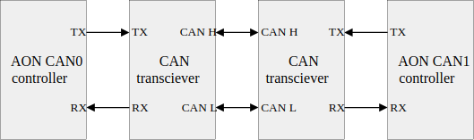

# CAN Devices

```{toctree}
:hidden:
can_motors/index
```

Meta-Team robots uses a wide range of CAN devices, mostly motors and encoders. This section provides some basic information on how to use these devices with Meta-ROS.

## CANable USB to CAN adapter

[CANable](https://canable.io/) is an open-source USB to CAN adapter. It can be directly recognized as a PCAN device in Linux, provided that you have the necessary kernel modules installed.

## On-board CAN interface

Many edge-computing devices have built-in CAN interfaces.

::::{tab-set}

:::{tab-item} Jetson Orin Nano (Devkit)
The Jetson Orin Nano Developer Kit has a built-in CAN controller. Unlike traditional CAN bus interfaces, the CAN interface on the board is not directly CAN bus voltage compatible (as the names `TX` and `RX` imply). You need a CAN transceiver to convert the voltage into CAN bus voltage levels (which is usually called `CAN_H` `CAN_L`).



Refer to [Jetson Linux developer guide](https://docs.nvidia.com/jetson/archives/r36.3/DeveloperGuide/HR/ControllerAreaNetworkCan.html) for more information on this.

:::

:::{tab-item} Jetson Orin Nano (DAMIAO)
To be updated.
:::

:::{tab-item} Orange Pi 5 Pro
To be updated.
:::

::::

## Setup CAN interfaces on Linux

CAN interfaces are recognized as network sockets in Linux. You can directly see them with `ip` command.

```bash
ip link show
```

To setup a CAN interface, you can simply treat it as a plain network interface. 

```bash
sudo ip link set can0 type can bitrate 1000000
sudo ip link set up can0
```

This configures `can0` with a bitrate of 1Mbps and brings it up.

## SocketCAN utilities

SocketCAN provides a set of utilities to work with CAN interfaces.

### candump

`candump` is a simple utility to see CAN messages on the bus. You can see all messages on `can0` with:

```bash
candump can0
```

### cansend

`cansend` is a simple utility to send CAN messages. You can send a message with CAN ID `0x123` and data `0x11 0x22 0x33` with:

```bash
cansend can0 123#112233
```
